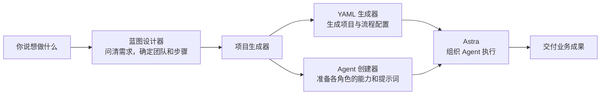

```mermaid
flowchart LR
    A["你说想做什么"] --> B["蓝图设计器<br/>问清需求，确定团队和步骤"]
    B --> C["项目生成器"]
    C --> D["YAML 生成器<br/>生成项目与流程配置"]
    C --> E["Agent 创建器<br/>准备各角色的能力和提示词"]
    D --> F["Astra<br/>组织 Agent 执行"]
    E --> F
    F --> G["交付业务成果"]
```